```mermaid
erDiagram
    forms ||--o{ signals : "form_type"
    signals ||--o| form_3 : "accession"
    signals ||--o| form_4 : "accession"
    signals ||--o| form_4_a : "accession"
    signals ||--o| form_5 : "accession"
    signals ||--o| form_8_k : "accession"
    signals ||--o| form_10_q : "accession"
    signals ||--o| form_13f_hr : "accession"
    signals ||--o| form_13f_nt : "accession"
    signals ||--o| form_144 : "accession"
    signals ||--o| form_144_a : "accession"
    signals ||--o| form_n_cen : "accession"
    signals ||--o| form_n_px : "accession"
    signals ||--o| form_n_14 : "accession"
    signals ||--o| form_n_port : "accession"
    signals ||--o| form_c : "accession"
    signals ||--o| form_c_a : "accession"
    signals ||--o| form_d_a : "accession"
    signals ||--o| form_sc_13d : "accession"
    signals ||--o| form_sc_13g : "accession"
    signals ||--o| form_s_1 : "accession"
    signals ||--o| form_s_1_a : "accession"
    signals ||--o| form_s_3 : "accession"
    signals ||--o| form_425 : "accession"
    signals ||--o| form_424b5 : "accession"
    signals ||--o| form_fwp : "accession"
    signals ||--o| form_def_14a : "accession"
    signals ||--o| form_40_app : "accession"
    signals ||--o{ signal_ciks : "accession"
    cik_list ||--o{ signal_ciks : "cik"
    cik_list ||--o| companies : "company_cik XOR"
    cik_list ||--o| people : "person_cik XOR"
    companies ||--o{ company_filings : "company_cik"
    people ||--o{ people_filings : "person_cik"

    forms {
        text form PK
        text purpose
        text why_filed
        text nubeam_relevance
        text signal_side "allocator or seeker"
        bigint filings_count
        bigint companies_count
    }

    signals {
        text accession PK
        text form_type FK
        date date_added
    }

    signal_ciks {
        text accession PK
        text cik PK
        text cik_role PK "filer issuer company person intermediary reg"
    }

    cik_list {
        text cik PK
        date date_added
        boolean enriched "worker watches FALSE"
    }

    companies {
        text company_cik PK
        text name
        text ticker
        text exchanges
        text former_names
        text sic
        text sic_description
        text state_of_incorp
        text address
        text website
        text investor_website
        text fiscal_year_end
        text entity_type
        text filer_category
    }

    people {
        text person_cik PK
        text canonical_name
        text former_names
        text address
        text entity_type
    }

    company_filings {
        text company_cik PK
        text accession PK
        text form
        date filing_date
        text items "8-K codes"
    }

    people_filings {
        text person_cik PK
        text accession PK
        text form
        date filing_date
    }

    form_4 {
        text accession PK
        text issuer_cik
        text person_cik
        text payload "form-specific cols"
    }

    form_3 {
        text accession PK
        text payload "form-specific cols"
    }

    form_4_a {
        text accession PK
        text payload "form-specific cols"
    }

    form_5 {
        text accession PK
        text payload "form-specific cols"
    }

    form_8_k {
        text accession PK
        text payload "form-specific cols"
    }

    form_10_q {
        text accession PK
        text payload "form-specific cols"
    }

    form_13f_hr {
        text accession PK
        text payload "form-specific cols"
    }

    form_13f_nt {
        text accession PK
        text payload "form-specific cols"
    }

    form_144 {
        text accession PK
        text payload "form-specific cols"
    }

    form_144_a {
        text accession PK
        text payload "form-specific cols"
    }

    form_n_cen {
        text accession PK
        text payload "form-specific cols"
    }

    form_n_px {
        text accession PK
        text payload "form-specific cols"
    }

    form_n_14 {
        text accession PK
        text payload "form-specific cols"
    }

    form_n_port {
        text accession PK
        text payload "form-specific cols"
    }

    form_c {
        text accession PK
        text payload "form-specific cols"
    }

    form_c_a {
        text accession PK
        text payload "form-specific cols"
    }

    form_d_a {
        text accession PK
        text payload "form-specific cols"
    }

    form_sc_13d {
        text accession PK
        text payload "form-specific cols"
    }

    form_sc_13g {
        text accession PK
        text payload "form-specific cols"
    }

    form_s_1 {
        text accession PK
        text payload "form-specific cols"
    }

    form_s_1_a {
        text accession PK
        text payload "form-specific cols"
    }

    form_s_3 {
        text accession PK
        text payload "form-specific cols"
    }

    form_425 {
        text accession PK
        text payload "form-specific cols"
    }

    form_424b5 {
        text accession PK
        text payload "form-specific cols"
    }

    form_fwp {
        text accession PK
        text payload "form-specific cols"
    }

    form_def_14a {
        text accession PK
        text payload "form-specific cols"
    }

    form_40_app {
        text accession PK
        text payload "form-specific cols"
    }
```

# Schema Graph

```
┌──────────────────────────────────────────────────────────────────────────────┐
│  LAYER 0 · REGISTRY                                                          │
│                                                                              │
│            ┌────────────────────────────┐                                    │
│            │ forms                      │                                    │
│            │ ─────────                  │                                    │
│            │ PK  form          text     │  27 rows                           │
│            │     purpose                │  signal_side ∈ {allocator,seeker}  │
│            │     why_filed              │                                    │
│            │     nubeam_relevance       │                                    │
│            │     signal_side            │                                    │
│            │     filings_count   bigint │                                    │
│            │     companies_count bigint │                                    │
│            └─────────────▲──────────────┘                                    │
└──────────────────────────│───────────────────────────────────────────────────┘
                           │ form_type → form  (N:1, RESTRICT)
┌──────────────────────────│───────────────────────────────────────────────────┐
│  LAYER 1 · SIGNALS       │                                                   │
│                          │                                                   │
│       ┌──────────────────┴───────────┐                                       │
│       │ signals                      │                                       │
│       │ ────────                     │                                       │
│       │ PK accession  text           │ master event router                   │
│       │    form_type  text  (FK)     │ idx (form_type, date_added)           │
│       │    date_added date           │                                       │
│       └───┬──────────────────────┬───┘                                       │
│           │ 1:1 CASCADE          │ 1:N CASCADE                               │
│           │ (×27 form tables)    │                                           │
│           ▼                      ▼                                           │
│   ┌───────────────┐      ┌──────────────────────────┐                        │
│   │ form_X (×27)  │      │ signal_ciks              │  junction              │
│   │ ────────────  │      │ ───────────              │                        │
│   │ PK+FK         │      │ PK accession  (FK)       │                        │
│   │   accession   │      │ PK cik        (FK)       │                        │
│   │   <payload…>  │      │ PK cik_role              │                        │
│   │   filer_cik   │      │   roles:                 │                        │
│   │   issuer_cik  │      │     filer_cik            │                        │
│   │   company_cik │      │     issuer_cik           │                        │
│   │   person_cik  │      │     company_cik          │                        │
│   │   …           │      │     person_cik           │                        │
│   └───────────────┘      │     intermediary_cik     │                        │
│                          │     reg_cik              │                        │
│                          └────────────┬─────────────┘                        │
│                                       │ N:1 CASCADE                          │
└───────────────────────────────────────│──────────────────────────────────────┘
                                        │
┌───────────────────────────────────────│──────────────────────────────────────┐
│  LAYER 2 · ENTITIES                   ▼                                      │
│                          ┌──────────────────────────┐                        │
│                          │ cik_list                 │  master CIK registry   │
│                          │ ────────                 │                        │
│                          │ PK cik         text      │                        │
│                          │    date_added  date      │                        │
│                          │    enriched    bool      │  worker watches FALSE  │
│                          └──────┬───────────┬───────┘                        │
│                                 │ 1:1       │ 1:1   (XOR — app-enforced)     │
│                                 │ CASCADE   │ CASCADE                        │
│                                 ▼           ▼                                │
│              ┌──────────────────────┐   ┌──────────────────────┐             │
│              │ companies            │   │ people               │             │
│              │ ─────────            │   │ ──────               │             │
│              │ PK+FK company_cik    │   │ PK+FK person_cik     │             │
│              │   name               │   │   canonical_name     │             │
│              │   ticker             │   │   former_names       │             │
│              │   exchanges          │   │   address            │             │
│              │   former_names       │   │   entity_type        │             │
│              │   sic, sic_desc      │   └──────────┬───────────┘             │
│              │   state_of_incorp    │              │                         │
│              │   address            │              │                         │
│              │   website            │              │                         │
│              │   investor_website   │              │                         │
│              │   fiscal_year_end    │              │                         │
│              │   entity_type        │              │                         │
│              │   filer_category     │              │                         │
│              └──────────┬───────────┘              │                         │
│                         │ 1:N CASCADE              │ 1:N CASCADE             │
└─────────────────────────│──────────────────────────│─────────────────────────┘
                          │                          │
┌─────────────────────────│──────────────────────────│─────────────────────────┐
│  LAYER 3 · FILINGS      ▼                          ▼                         │
│           ┌──────────────────────┐    ┌──────────────────────┐               │
│           │ company_filings      │    │ people_filings       │               │
│           │ ───────────────      │    │ ──────────────       │               │
│           │ PK company_cik (FK)  │    │ PK person_cik (FK)   │               │
│           │ PK accession         │    │ PK accession         │               │
│           │    form              │    │    form              │               │
│           │    filing_date       │    │    filing_date       │               │
│           │    items (8-K only)  │    │                      │               │
│           │ idx (filing_date)    │    │ idx (filing_date)    │               │
│           │ idx (form)           │    │ idx (form)           │               │
│           └──────────────────────┘    └──────────────────────┘               │
│                                                                              │
│  Filter rules (app-enforced, not DB):                                        │
│    • form ∈ scrape_list (the 27 forms in registry)                           │
│    • filing_date >= CURRENT_DATE - INTERVAL '3 years'                        │
└──────────────────────────────────────────────────────────────────────────────┘
```

## Relationship matrix

| From                          | To                  | Card | On Delete |
|-------------------------------|---------------------|------|-----------|
| signals.form_type             | forms.form          | N:1  | RESTRICT  |
| form_X.accession (×27)        | signals.accession   | 1:1  | CASCADE   |
| signal_ciks.accession         | signals.accession   | N:1  | CASCADE   |
| signal_ciks.cik               | cik_list.cik        | N:1  | CASCADE   |
| companies.company_cik         | cik_list.cik        | 1:1  | CASCADE   |
| people.person_cik             | cik_list.cik        | 1:1  | CASCADE   |
| company_filings.company_cik   | companies.company_cik | N:1| CASCADE   |
| people_filings.person_cik     | people.person_cik   | N:1  | CASCADE   |

## Data flow

```
SEC stream/mine
      │
      ▼
  ┌─────────┐    ┌──────────┐
  │ signals │ ─→ │ form_X   │   per-form payload
  └────┬────┘    └──────────┘
       │
       ▼
  ┌─────────────┐
  │ signal_ciks │   extract every CIK + role
  └──────┬──────┘
         ▼
  ┌──────────┐
  │ cik_list │   dedupe; enriched=false
  └────┬─────┘
       │ enrichment worker (SEC API)
       ▼
  ┌───────────┐     ┌────────┐
  │ companies │ XOR │ people │
  └─────┬─────┘     └───┬────┘
        ▼               ▼
  ┌──────────────┐  ┌────────────────┐
  │company_filings│  │ people_filings │   per-entity history (3yr window)
  └──────────────┘  └────────────────┘
```

## Form table list (27)

```
form_3       form_4       form_4_a     form_5
form_8_k     form_10_q    form_13f_hr  form_13f_nt
form_144     form_144_a   form_n_cen   form_n_px
form_n_14    form_n_port  form_c       form_c_a
form_d_a     form_sc_13d  form_sc_13g  form_s_1
form_s_1_a   form_s_3     form_425     form_424b5
form_fwp     form_def_14a form_40_app
```


